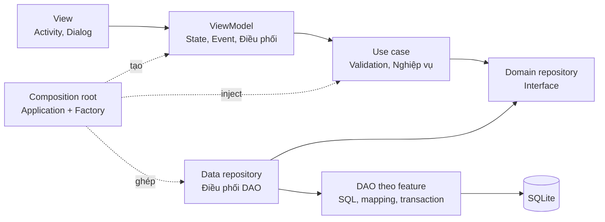
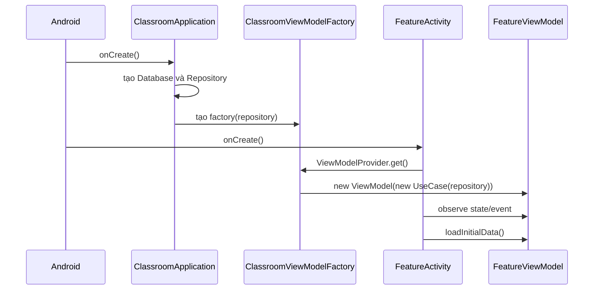
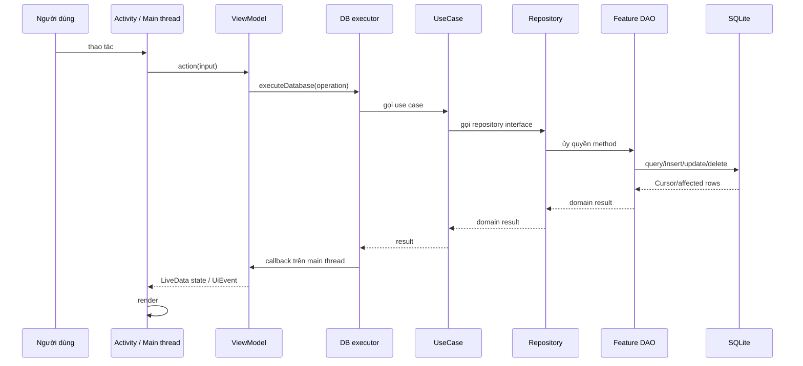
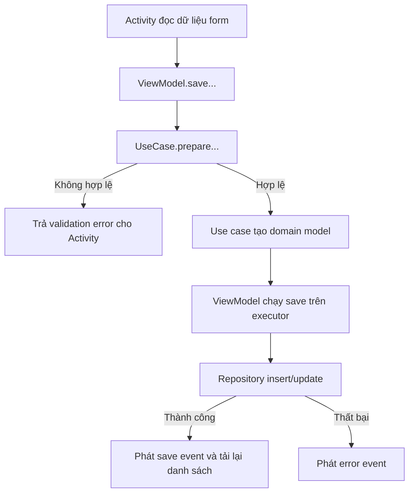
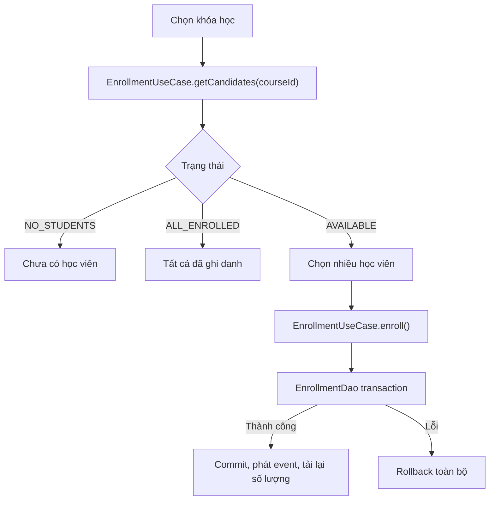
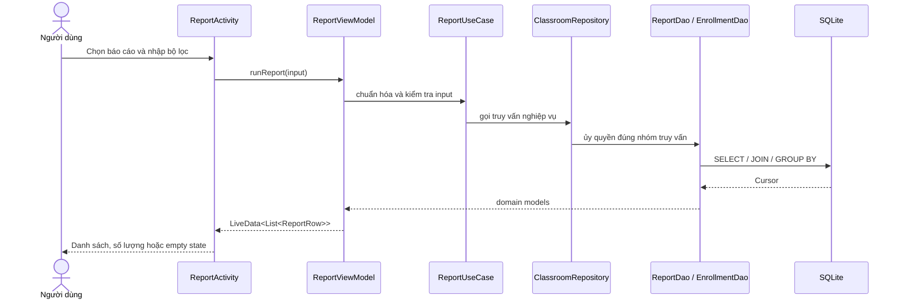
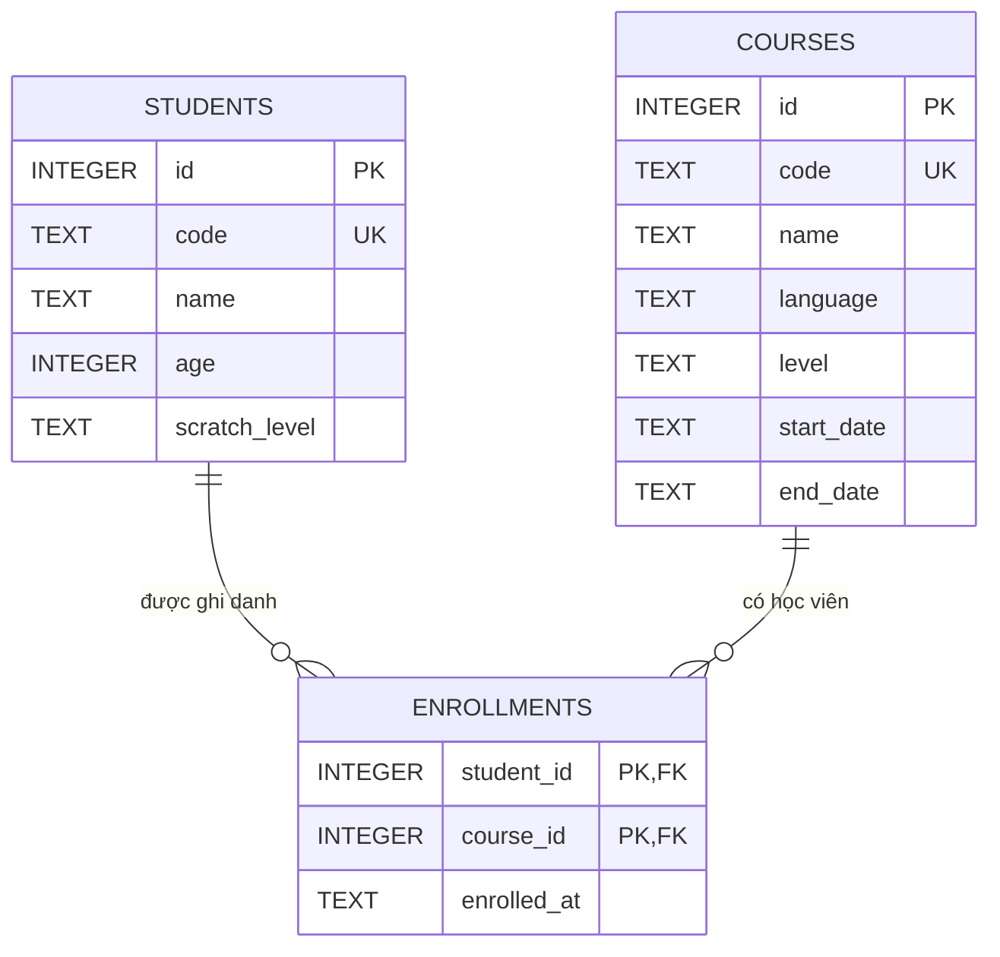

# Kiến trúc và luồng hoạt động của ứng dụng

Cập nhật: 05/08/2026

## 1. Mục tiêu kiến trúc

Ứng dụng Android quản lý lớp học lập trình, viết bằng Java và lưu dữ liệu cục bộ bằng SQLite. Kiến trúc hiện tại áp dụng MVVM kết hợp phân tầng theo hướng Clean Architecture với các mục tiêu:

- View chỉ nhận thao tác người dùng và render trạng thái.
- ViewModel giữ UI state, điều phối tác vụ và không biết SQLite.
- Use case chứa validation và luồng nghiệp vụ của từng chức năng.
- Repository interface định nghĩa cổng truy cập dữ liệu cho domain.
- Data layer là nơi duy nhất chứa SQLite, `Cursor`, SQL và transaction.
- Dependency chỉ được lắp ghép tại composition root.
- Mọi I/O chạy ngoài main thread; mọi cập nhật UI state chạy trên main thread.

## 2. Chiều phụ thuộc



Chiều phụ thuộc source chính là:

```text
presentation → domain ← data
       ↑          ↑
       └──── di ──┘
```

`presentation` không import `data`, không giữ repository và không tự tạo use case. Package `di` là ngoại lệ có chủ đích vì đây là nơi ghép các implementation lúc runtime.

## 3. Cấu trúc source

```text
com.example.quanlynhansu
├── ClassroomApplication.java
├── di
│   └── ClassroomViewModelFactory.java
├── data
│   ├── local
│   │   ├── ClassroomDatabase.java
│   │   └── dao
│   │       ├── StudentDao.java
│   │       ├── CourseDao.java
│   │       ├── EnrollmentDao.java
│   │       ├── ReportDao.java
│   │       ├── EntityCursorMapper.java
│   │       └── SqliteBatchDelete.java
│   └── repository
│       └── SqliteClassroomRepository.java
├── domain
│   ├── model
│   │   ├── Student.java
│   │   ├── Course.java
│   │   ├── CourseSummary.java
│   │   ├── CourseStatistic.java
│   │   └── Enrollment.java
│   ├── repository
│   │   └── ClassroomRepository.java
│   ├── usecase
│   │   ├── StudentUseCase.java
│   │   ├── CourseUseCase.java
│   │   ├── EnrollmentUseCase.java
│   │   ├── EnrollmentCandidates.java
│   │   └── ReportUseCase.java
│   └── validation
│       ├── StudentInputValidator.java
│       ├── CourseInputValidator.java
│       └── ReportFilterValidator.java
└── presentation
    ├── MainActivity.java
    ├── common
    │   ├── BaseListViewModel.java
    │   ├── BaseMvvmListActivity.java
    │   ├── UiEvent.java
    │   ├── ListRow.java
    │   ├── FormViews.java
    │   ├── SelectionControls.java
    │   └── SystemBars.java
    ├── student
    │   ├── StudentActivity.java
    │   └── StudentViewModel.java
    ├── course
    │   ├── CourseActivity.java
    │   └── CourseViewModel.java
    ├── enrollment
    │   ├── EnrollmentActivity.java
    │   └── EnrollmentViewModel.java
    └── report
        ├── ReportActivity.java
        ├── ReportViewModel.java
        └── ReportRow.java
```

## 4. Trách nhiệm từng tầng

### 4.1. Presentation — View

Các Activity chỉ thực hiện:

1. Đọc giá trị từ Android View.
2. Gửi action và dữ liệu thô cho ViewModel.
3. Observe `LiveData` state hoặc `UiEvent`.
4. Render danh sách, loading, empty state, dialog, Toast và lỗi `EditText`.
5. Chuyển domain validation error thành thông báo phù hợp với Android View.

Activity không được:

- Gọi repository hoặc SQLite.
- Khởi tạo validator/use case.
- Tạo `Student`/`Course` từ dữ liệu form.
- Chạy I/O hoặc tự quản lý worker thread.

`BaseMvvmListActivity` dùng chung phần adapter, loading/empty state, selection mode và lấy ViewModel từ factory. Nó không biết repository implementation.

### 4.2. Presentation — ViewModel

Mỗi feature có một ViewModel tương ứng. ViewModel:

- Nhận đúng một use case qua constructor.
- Giữ danh sách, selection, loading và trạng thái báo cáo.
- Nhận action từ View rồi gọi use case.
- Chuyển kết quả domain thành UI state hoặc one-shot event.
- Không import `Context`, `Activity`, `View`, `SQLiteDatabase` hoặc data implementation.

`BaseListViewModel` cung cấp quy ước dùng chung:

| Method | Ý nghĩa |
|---|---|
| `loadInitialData()` | Yêu cầu tải dữ liệu đầu tiên đúng một lần trong vòng đời ViewModel |
| `onInitialLoad()` | Feature triển khai tác vụ tải ban đầu |
| `executeDatabase()` | Chạy operation trên single-thread executor và trả callback về main thread |
| `replaceItems()` | Thay danh sách và loại các selected ID không còn hợp lệ |
| `showLoading()` / `hideLoading()` | Cập nhật loading state trên main thread |
| `showError()` | Phát one-shot error event dùng chung |

### 4.3. Domain — Use case và validation

Use case là API nghiệp vụ duy nhất mà ViewModel sử dụng:

| Use case | Trách nhiệm |
|---|---|
| `StudentUseCase` | Validate form, tạo `Student`, tải/lưu/xóa học viên |
| `CourseUseCase` | Validate form, tạo `Course`, tải/lưu/xóa khóa học |
| `EnrollmentUseCase` | Tải khóa học, lọc ứng viên, ghi danh và hủy ghi danh |
| `ReportUseCase` | Chuẩn hóa bộ lọc và cung cấp dữ liệu cho toàn bộ báo cáo/truy vấn |

Validator là Java thuần, không biết Android. Kết quả validation được use case trả về cho ViewModel; Activity chỉ ánh xạ mã lỗi sang `EditText.setError()`.

### 4.4. Domain — Repository contract

`ClassroomRepository` chỉ khai báo thao tác dữ liệu cần thiết cho use case. Interface dùng domain model và kiểu Java thuần, không để lộ `Cursor`, tên bảng hoặc `SQLiteException`.

### 4.5. Data

`ClassroomDatabase` chịu trách nhiệm:

- Tạo schema và index.
- Bật foreign key.
- Seed dữ liệu mẫu.
- Migration database.

Các DAO được tách theo feature:

| DAO/helper | Trách nhiệm |
|---|---|
| `StudentDao` | SQL CRUD học viên và xóa nhiều học viên |
| `CourseDao` | SQL CRUD khóa học và xóa nhiều khóa học |
| `EnrollmentDao` | Summary theo khóa, truy vấn thành viên, transaction ghi danh/hủy ghi danh |
| `ReportDao` | Truy vấn học viên chưa ghi danh, khoảng tuổi, thống kê ngôn ngữ/cấp độ và ghi danh theo thời gian |
| `EntityCursorMapper` | Map `Cursor` sang `Student`/`Course`, chỉ dùng nội bộ package DAO |
| `SqliteBatchDelete` | Transaction xóa nhiều entity dùng chung cho Student/Course DAO |

`SqliteClassroomRepository` implement `ClassroomRepository` và chỉ ủy quyền method cho DAO phù hợp. Repository không chứa SQL, `Cursor`, `ContentValues` hoặc transaction. Cách tách này giữ API domain ổn định nhưng tránh tập trung mọi truy vấn trong một file lớn.

Data layer không chứa ViewModel, Android View hoặc thông báo hiển thị.

### 4.6. Composition root

`ClassroomApplication` tạo duy nhất một `ClassroomDatabase`, một `SqliteClassroomRepository` và một `ClassroomViewModelFactory`. Repository khởi tạo bốn DAO dùng chung cùng database helper; Activity/ViewModel không nhìn thấy các DAO này.

Factory là nơi duy nhất biết đồng thời repository, use case và concrete ViewModel:

```text
StudentViewModel    ← StudentUseCase    ← ClassroomRepository
CourseViewModel     ← CourseUseCase     ← ClassroomRepository
EnrollmentViewModel ← EnrollmentUseCase ← ClassroomRepository
ReportViewModel     ← ReportUseCase     ← ClassroomRepository
```

Activity chỉ yêu cầu ViewModel từ `ViewModelProvider`; không truyền dependency bằng `init()`.

## 5. State, event và lifecycle

Hai loại dữ liệu presentation được phân biệt rõ:

- **State**: danh sách, loading, selection, khóa học và tiêu đề báo cáo. State dùng `LiveData<T>` và được phát lại cho Activity mới sau configuration change.
- **Event**: thông báo lỗi, kết quả lưu, ghi danh hoặc hủy ghi danh. Event dùng `LiveData<UiEvent<T>>`; `consume()` bảo đảm side effect không lặp lại sau rotation.

Danh sách và selection nằm trong ViewModel nên không bị reset khi Activity được tạo lại. Sau khi Activity gắn layout mới, `BaseMvvmListActivity` render lại ngay loading/content state đang giữ trong ViewModel.

Dialog và text đang nhập vẫn là transient View state; nếu cần hỗ trợ process recreation đầy đủ, bổ sung `SavedStateHandle` hoặc form state model cho từng ViewModel.

## 6. Luồng khởi động



## 7. Luồng chạy tác vụ dữ liệu



Quy tắc threading:

- Use case/repository có I/O luôn được gọi trong `executeDatabase()`.
- Operation chạy tuần tự trên một executor của ViewModel.
- Success/error callback được đưa về main thread trước khi cập nhật `LiveData`.
- `onCleared()` dừng executor và loại callback đang chờ.

## 8. Luồng quản lý học viên và khóa học

Luồng Student và Course dùng cùng một mẫu:



Entity mới dùng ID `-1`; repository thực hiện insert. Entity có ID hợp lệ được update theo `id`.

Xóa một hoặc nhiều đối tượng cũng đi qua ViewModel và use case. Batch delete chạy trong transaction; nếu một ID không còn tồn tại, toàn bộ batch rollback.

## 9. Luồng ghi danh



`getCandidates()` lấy toàn bộ học viên và học viên đã thuộc khóa, dùng `Set<Long>` để lọc danh sách còn khả dụng. `EnrollmentDao` trả `CourseSummary` bằng một truy vấn `LEFT JOIN ... GROUP BY`, tránh N+1 query khi render.

Hủy ghi danh sử dụng cùng luồng `Activity → ViewModel → EnrollmentUseCase → Repository` và transaction all-or-nothing khi chọn nhiều học viên.

## 10. Luồng báo cáo

`ReportActivity` là màn hình riêng, truy cập từ Trang chủ. Người dùng chọn loại báo cáo, nhập bộ lọc tương ứng rồi nhấn **Xem báo cáo**. Activity chỉ đọc input và render `ReportRow`; `ReportViewModel` gọi `ReportUseCase`, còn SQL nằm trong DAO.

Các cách xem báo cáo/truy vấn hiện có:

1. Học viên theo một khóa học được chọn.
2. Tất cả khóa học kèm số học viên, kể cả khóa chưa có học viên.
3. Học viên chưa ghi danh vào bất kỳ khóa nào.
4. Học viên trong khoảng tuổi tùy chọn từ 5 đến 18.
5. Số khóa học và số lượt ghi danh theo ngôn ngữ.
6. Số khóa học và số lượt ghi danh theo cấp độ.
7. Danh sách ghi danh theo khoảng ngày.
8. Truy vấn nhanh học viên 10–12 tuổi đã ghi danh khóa Python cơ bản.



Truy vấn thành viên và tổng số theo khóa thuộc `EnrollmentDao`; các truy vấn phân tích chuyên biệt thuộc `ReportDao`. Cách tách này tránh một file truy vấn khổng lồ nhưng vẫn giữ một cổng dữ liệu nhất quán là `ClassroomRepository`.

## 11. Mô hình dữ liệu



Các invariant được bảo vệ ở nhiều mức:

- Use case kiểm tra dữ liệu form trước khi tạo domain model.
- Database giới hạn tuổi 5–18, language hợp lệ, code duy nhất và ngày bắt đầu không sau ngày kết thúc.
- Khóa chính ghép ngăn ghi danh trùng.
- Foreign key cascade xóa ghi danh khi xóa học viên/khóa học.
- Transaction bảo đảm batch operation all-or-nothing.

Database hiện ở version 5. Migration v3 tạo index theo khóa học; migration v4 bổ sung seed; migration v5 thêm `courses.start_date`, `courses.end_date`, `enrollments.enrolled_at` và index theo thời điểm ghi danh mà không xóa dữ liệu cũ.

## 12. Kiểm thử và nguyên tắc mở rộng

Kiểm thử hiện có gồm unit test validation/use case và instrumented test cho database, transaction, summary và migration.

Khi thêm feature mới:

1. Tạo hoặc mở rộng domain model nếu có khái niệm nghiệp vụ mới.
2. Viết validator/use case trước; không đặt business rule trong Activity.
3. Chỉ mở rộng repository interface khi use case cần thêm dữ liệu.
4. Implement SQL trong DAO đúng feature; dùng mapper/helper nội bộ khi có logic persistence lặp lại.
5. Tạo ViewModel nhận use case qua constructor.
6. Đăng ký ViewModel/use case trong `ClassroomViewModelFactory`.
7. Activity chỉ gửi action và observe state/event.
8. Viết unit test cho use case, ViewModel; viết instrumented test cho SQLite.

Không gọi repository từ Activity, không import data implementation trong presentation, không đặt SQL trong domain/presentation và không cập nhật Android View từ worker thread.
