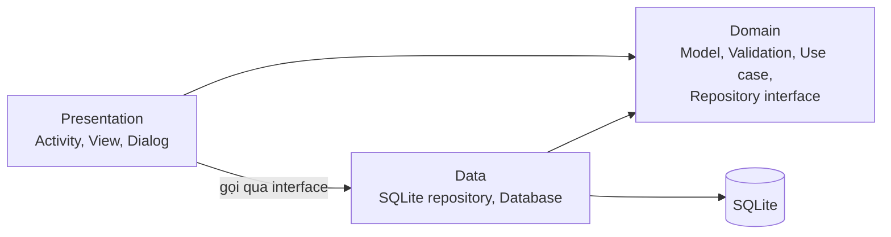
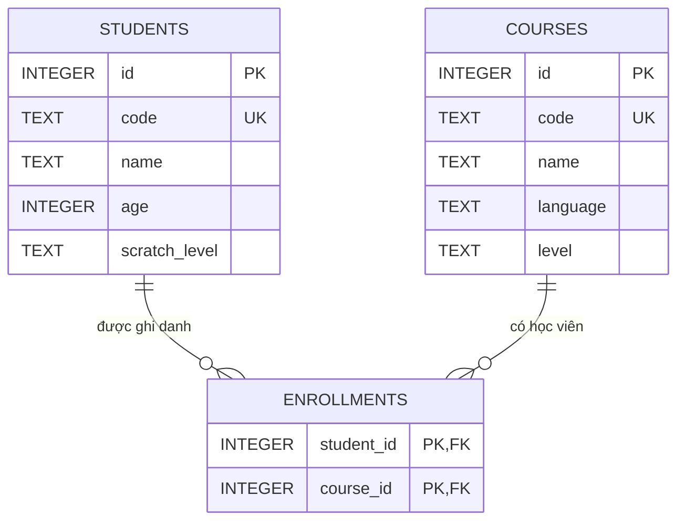
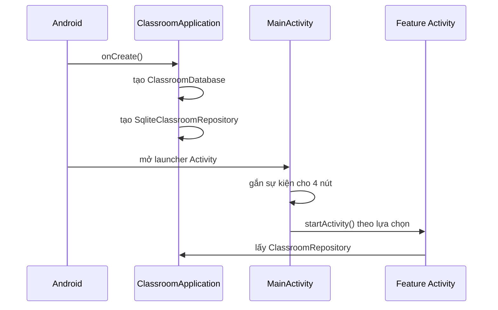
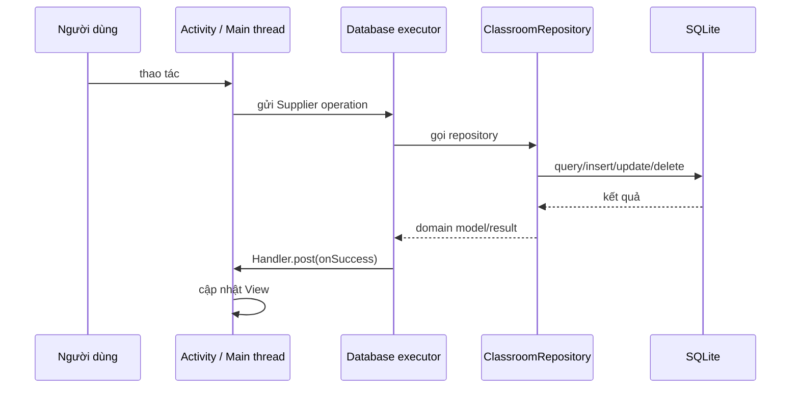
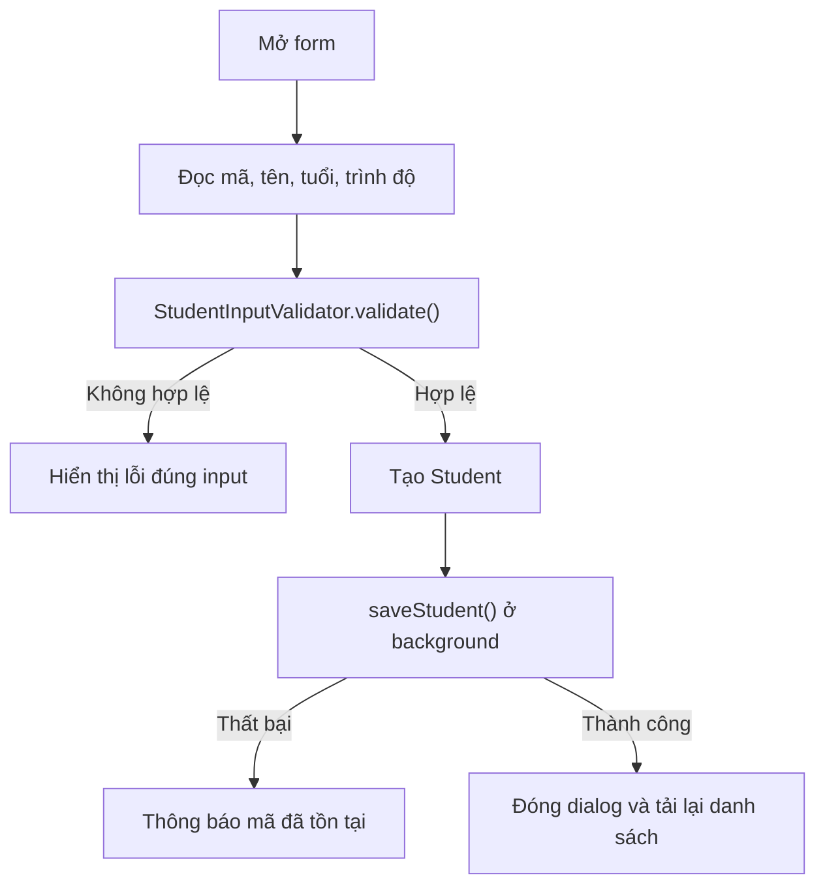
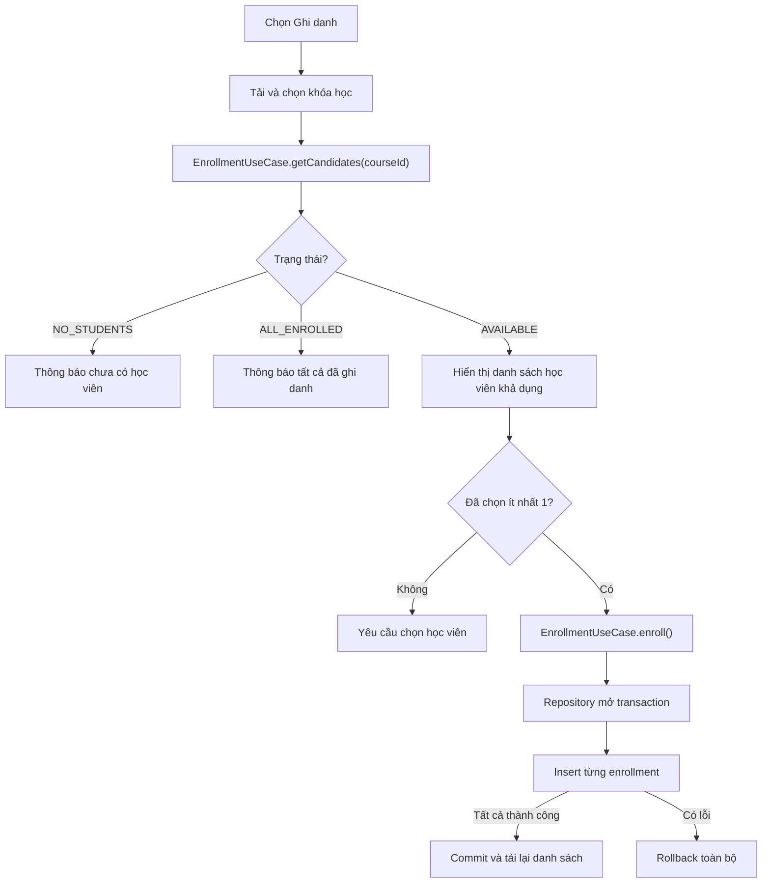

# Kiến trúc và luồng hoạt động của ứng dụng

Cập nhật: 26/07/2026

## 1. Tổng quan

Ứng dụng Android quản lý lớp học lập trình cho trẻ, viết bằng Java và lưu dữ liệu cục bộ bằng SQLite. Các chức năng chính:

- Quản lý học viên.
- Quản lý khóa học.
- Ghi danh hoặc hủy ghi danh học viên.
- Liệt kê học viên theo khóa học.
- Tìm học viên 10–12 tuổi đã ghi danh khóa Python cấp độ Cơ bản.

Ứng dụng được tổ chức theo ba vùng trách nhiệm chính:



Chiều phụ thuộc ở mức source là `presentation → domain ← data`. Việc ghép interface với SQLite implementation chỉ diễn ra tại `ClassroomApplication`, là composition root của ứng dụng.

## 2. Cấu trúc source

```text
com.example.quanlynhansu
├── ClassroomApplication.java
├── data
│   ├── local
│   │   └── ClassroomDatabase.java
│   └── repository
│       └── SqliteClassroomRepository.java
├── domain
│   ├── model
│   │   ├── Student.java
│   │   ├── Course.java
│   │   ├── CourseSummary.java
│   │   └── Enrollment.java
│   ├── repository
│   │   └── ClassroomRepository.java
│   ├── usecase
│   │   ├── EnrollmentCandidates.java
│   │   └── EnrollmentUseCase.java
│   └── validation
│       ├── StudentInputValidator.java
│       └── CourseInputValidator.java
└── presentation
    ├── MainActivity.java
    ├── common
    │   ├── BaseListActivity.java
    │   └── FormViews.java
    ├── student
    │   └── StudentActivity.java
    ├── course
    │   └── CourseActivity.java
    ├── enrollment
    │   └── EnrollmentActivity.java
    └── report
        └── ReportActivity.java
```

### 2.1. Composition root

`ClassroomApplication` tạo một `ClassroomDatabase`, bọc nó bằng `SqliteClassroomRepository` và công bố dưới kiểu `ClassroomRepository`.

Mọi Activity kế thừa `BaseListActivity` chỉ nhận repository interface. Presentation không tự khởi tạo và không import SQLite implementation.

### 2.2. Presentation

| Thành phần | Trách nhiệm |
|---|---|
| `MainActivity` | Hiển thị trang chủ và điều hướng đến bốn nhóm chức năng |
| `BaseListActivity<T>` | Quản lý danh sách chung, chạy tác vụ database ở background, chuyển kết quả về main thread và xử lý system bar inset |
| `FormViews` | Tạo các input/spinner dùng chung cho dialog form |
| `StudentActivity` | Form và danh sách CRUD học viên |
| `CourseActivity` | Form và danh sách CRUD khóa học |
| `EnrollmentActivity` | UI chọn khóa, chọn nhiều học viên, xem và hủy ghi danh |
| `ReportActivity` | UI chọn và hiển thị hai loại báo cáo |

Activity chỉ nên chịu trách nhiệm:

1. Đọc sự kiện và dữ liệu từ View.
2. Gọi validator/use case/repository.
3. Chuyển kết quả thành trạng thái hiển thị.
4. Không chứa SQL hoặc thao tác I/O trực tiếp.

### 2.3. Domain

| Thành phần | Vai trò |
|---|---|
| `Student` | Dữ liệu học viên |
| `Course` | Dữ liệu khóa học và các hằng ngôn ngữ/cấp độ |
| `CourseSummary` | Một khóa học kèm tổng số học viên, dùng để render danh sách mà không phát sinh query |
| `Enrollment` | Biểu diễn quan hệ học viên–khóa học; hiện không nằm trong luồng UI chính |
| `StudentInputValidator` | Kiểm tra mã, tên và tuổi; trả về tuổi đã parse khi hợp lệ |
| `CourseInputValidator` | Kiểm tra mã và tên khóa học bắt buộc |
| `EnrollmentUseCase` | Lọc học viên chưa thuộc khóa và thực hiện batch ghi danh |
| `EnrollmentCandidates` | Kết quả use case với trạng thái `AVAILABLE`, `NO_STUDENTS` hoặc `ALL_ENROLLED` |
| `ClassroomRepository` | Contract dữ liệu mà presentation/use case được phép sử dụng |

### 2.4. Data

`ClassroomDatabase` quản lý schema, foreign key, index, seed và migration.

`SqliteClassroomRepository`:

- Chuyển domain model thành `ContentValues`.
- Chuyển `Cursor` thành domain model.
- Thực hiện CRUD và các truy vấn báo cáo.
- Dùng transaction cho batch ghi danh.
- Không chứa code hiển thị Android UI.

## 3. Mô hình dữ liệu



Các ràng buộc quan trọng:

- `students.code` và `courses.code` là duy nhất.
- Tuổi học viên nằm trong khoảng 5–18.
- Ngôn ngữ khóa học chỉ nhận `Scratch` hoặc `Python`.
- Khóa chính ghép `(student_id, course_id)` ngăn ghi danh trùng.
- Xóa học viên/khóa học sẽ xóa liên hoàn các ghi danh liên quan.
- Index `index_enrollments_course_id` hỗ trợ truy vấn theo khóa học.
- Foreign key được bật trong `onConfigure()`.

Database hiện ở phiên bản 3. Khi nâng từ phiên bản thấp hơn 3, migration chỉ tạo index còn thiếu và giữ nguyên bảng/dữ liệu. Với database mới, ứng dụng tạo schema, index rồi thêm dữ liệu mẫu.

## 4. Luồng khởi động và điều hướng



Trang chủ điều hướng:

| Nút | Màn hình |
|---|---|
| Học viên | `StudentActivity` |
| Khóa học | `CourseActivity` |
| Ghi danh | `EnrollmentActivity` |
| Báo cáo và truy vấn | `ReportActivity` |

## 5. Cơ chế chạy database bất đồng bộ

Mọi thao tác repository từ Activity đi qua `BaseListActivity.executeDatabase()`.



Quy tắc:

- SQLite không chạy trên main thread.
- UI chỉ được cập nhật trên main thread.
- Mỗi Activity dùng single-thread executor để giữ thứ tự tác vụ.
- Khi Activity bị hủy, executor dừng nhận việc mới và callback đang chờ bị xóa.
- Runtime exception từ data task được chuyển thành thông báo lỗi chung; Activity đã kết thúc không nhận callback.

## 6. Luồng quản lý học viên

### 6.1. Tải danh sách

1. `StudentActivity.onCreate()` thiết lập list và listener.
2. `loadStudents()` gửi `repository.getStudents()` sang database executor.
3. Repository query bảng `students`, sắp xếp theo tên và map `Cursor` thành `Student`.
4. Main thread nhận danh sách, cập nhật adapter và empty state.

### 6.2. Thêm hoặc sửa



Entity mới dùng ID `-1`; repository nhận biết đây là insert. Entity có ID hợp lệ được update theo `id`.

### 6.3. Xóa

1. Người dùng nhấn giữ dòng học viên.
2. UI hiển thị dialog xác nhận.
3. `deleteStudent(id)` chạy ở background.
4. Foreign key cascade xóa các ghi danh liên quan.
5. Nếu xóa thành công, danh sách được tải lại; nếu bản ghi không còn tồn tại, UI thông báo tương ứng.

## 7. Luồng quản lý khóa học

Luồng tương tự học viên:

- `getCourses()` tải danh sách.
- `CourseInputValidator` kiểm tra mã và tên.
- `saveCourse()` insert/update.
- `deleteCourse()` xóa khóa và cascade ghi danh.

Ngôn ngữ được chọn từ `Scratch`/`Python`; cấp độ được chọn từ `Cơ bản`/`Trung cấp`/`Nâng cao`.

## 8. Luồng ghi danh

### 8.1. Hiển thị danh sách khóa

`EnrollmentActivity` gọi `getCourseSummaries()`. Repository dùng một truy vấn `LEFT JOIN ... GROUP BY` để trả mỗi `CourseSummary` gồm khóa học và số học viên.

`render()` chỉ format dữ liệu có sẵn, không gọi database. Cách này tránh truy vấn N+1 khi danh sách được vẽ hoặc cuộn.

### 8.2. Ghi danh nhiều học viên



`EnrollmentUseCase.getCandidates()`:

1. Lấy toàn bộ học viên.
2. Lấy học viên đã thuộc khóa.
3. Chuyển ID đã ghi danh thành `Set` để lookup nhanh.
4. Lọc ra danh sách còn khả dụng.
5. Trả trạng thái nghiệp vụ rõ ràng cho UI.

Batch ghi danh theo chính sách all-or-nothing. Nếu một insert vi phạm constraint hoặc lỗi SQLite, transaction không được đánh dấu thành công và toàn bộ batch bị rollback.

### 8.3. Xem và hủy ghi danh

1. Chạm một khóa để gọi `getStudentsByCourse(courseId)`.
2. Dialog hiển thị học viên trong khóa.
3. Chạm học viên và xác nhận hủy.
4. `unenroll(studentId, courseId)` xóa đúng khóa chính ghép.
5. UI tải lại số lượng và danh sách trong khóa.

## 9. Luồng báo cáo

### 9.1. Học viên theo khóa

1. `ReportActivity` tải danh sách khóa vào spinner.
2. Người dùng chọn khóa và nhấn xem.
3. Repository chạy `getStudentsByCourse(courseId)`.
4. UI hiển thị danh sách và tổng số kết quả.

### 9.2. Học viên 10–12 tuổi thuộc Python cơ bản

Repository join `students`, `enrollments`, `courses`, sau đó lọc:

```text
student.age BETWEEN 10 AND 12
course.language = Python
course.level = Cơ bản
```

Query dùng `DISTINCT` để một học viên chỉ xuất hiện một lần nếu tham gia nhiều khóa Python cơ bản.

## 10. Validation và xử lý lỗi

Validation được tách khỏi Android View:

| Validator | Kết quả có thể trả |
|---|---|
| `StudentInputValidator` | Thiếu mã, thiếu tên, tuổi không phải số, tuổi ngoài 5–18, hoặc hợp lệ kèm tuổi đã parse |
| `CourseInputValidator` | Thiếu mã, thiếu tên hoặc hợp lệ |

Activity ánh xạ kết quả domain thành lỗi trên đúng `EditText`. Lỗi unique code hiện được nhận qua kết quả `< 1` từ repository và hiển thị thông báo mã đã tồn tại.

Các thao tác delete/unenroll kiểm tra giá trị boolean để phân biệt thành công với bản ghi không còn tồn tại.

## 11. Kiểm thử

### Unit test thuần Java

- Validation input học viên/khóa học.
- Parse và giới hạn tuổi.
- `EnrollmentUseCase` loại học viên đã ghi danh.
- Phân biệt chưa có học viên với tất cả đã ghi danh.
- Use case chuyển đúng danh sách ID xuống repository.

### Instrumented test

- Batch ghi danh rollback khi có enrollment trùng.
- `CourseSummary` trả đúng số lượng và vẫn chứa khóa chưa có học viên.
- Migration từ database v2 giữ dữ liệu và tạo index theo `course_id`.

Instrumented test cần Android device hoặc emulator để chạy.

## 12. Nguyên tắc khi mở rộng

Khi thêm chức năng mới:

1. Thêm hoặc mở rộng domain model nếu có khái niệm nghiệp vụ mới.
2. Đặt validation/quy tắc nhiều bước trong `domain.validation` hoặc `domain.usecase`.
3. Chỉ thêm method repository khi cần truy cập dữ liệu.
4. Thực thi SQL và mapping duy nhất trong data layer.
5. Gọi repository/use case bằng `executeDatabase()` nếu có I/O.
6. Để Activity tập trung vào sự kiện và render UI.
7. Viết unit test cho business rule và instrumented test cho schema/query/migration.

Không đặt SQL trong Activity, không gọi database trong `render()`, và không chạy repository trực tiếp trên main thread.

